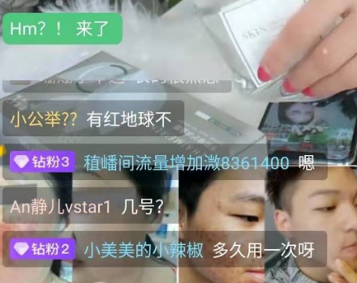
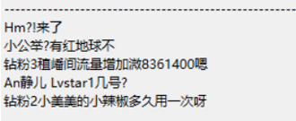
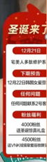
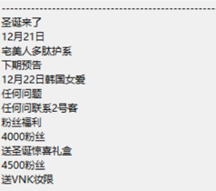

# 基于tensorflow、keras/pytorch实现对图片文字检测及端到端的OCR文字识别


## 实现功能

- 文字方向检测 0、90、180、270度检测 
- 文字检测 后期将切换到keras版本文本检测 实现keras端到端的文本检测及识别
- 不定长OCR识别


## 环境部署
``` 
Bash
##GPU环境
sh setup.sh
##CPU环境
sh setup-cpu.sh
##CPU python3环境
sh setup-python3.sh
使用环境：python3.6+tensorflow1.7+cpu/gpu
```

## 模型训练
* 一共分为3个网络
* 	**1. 文本方向检测网络-Classify(vgg16)**
*  **2. 文本区域检测网络-CTPN(CNN+RNN)**
*  **3. EndToEnd文本识别网络-CRNN(CNN+GRU/LSTM+CTC)**

## 文字方向检测-vgg分类
```
基于图像分类，在VGG16模型的基础上，训练0、90、180、270度检测的分类模型.
详细代码参考angle/predict.py文件，训练图片8000张，准确率88.23%
```
模型地址[BaiduCloud](https://pan.baidu.com/s/1zquQNdO0MUsLMsuwxbgPYg)

## 文字区域检测CTPN
支持CPU、GPU环境，一键部署，
[文本检测训练参考](https://github.com/eragonruan/text-detection-ctpn)  
 

## OCR 端到端识别:CRNN
### ocr识别采用GRU+CTC端到端识别技术，实现不分隔识别不定长文字
提供keras 与pytorch版本的训练代码，在理解keras的基础上，可以切换到pytorch版本，此版本更稳定


## 训练网络
### 1 对ctpn进行训练
* 定位到路径--./ctpn/ctpn/train_net.py
* 预训练的vgg网络路径[VGG_imagenet.npy](https://pan.baidu.com/s/1JO_ZojA5bkmJZsnxsShgkg)
将预训练权重下载下来，pretrained_model指向该路径即可,
此外整个模型的预训练权重[checkpoint](https://pan.baidu.com/s/1aT-vHgq7nvLy4M_T6SwR1Q)
* ctpn数据集[百度云](https://pan.baidu.com/s/1NXFmdP_OgRF42xfHXUhBHQ)
数据集下载完成并解压后，将.ctpn/lib/datasets/pascal_voc.py 文件中的pascal_voc 类中的参数self.devkit_path指向数据集的路径即可

### 2 对crnn进行训练
* keras版本 ./train/keras_train/train_batch.py  model_path--指向预训练权重位置 
MODEL_PATH---指向模型训练保存的位置
[keras模型预训练权重](https://pan.baidu.com/s/1vTG6-i_bFMWxQ_7xF06usg)
* pythorch版本./train/pytorch-train/crnn_main.py
```
parser.add_argument(
    '--crnn',
    help="path to crnn (to continue training)",
    default=预训练权重的路径)
parser.add_argument(
    '--experiment',
    help='Where to store samples and models',
    default=模型训练的权重保存位置)
```
[pytorch预训练权重](https://pan.baidu.com/s/1LEDNHEr3luloB7eZK6GOeA)


## 识别结果显示
### 文字检测及OCR识别结果

`===========================================================`



`===========================================================`



## 在思乐中的运用
从主播的直播间评论区可获得新进入直播间粉丝信息，以及直播间粉丝实时评论，
在无法获取直播平台数据时，通过CV可提取到需要的用户行为数据，用于用户价值的实时精准分级。

## 参考

- [pytorch 实现crnn](https://github.com/meijieru/crnn.pytorch.git)    
- [keras-crnn 版本实现参考](https://www.zhihu.com/question/59645822)  
- [tensorflow-crnn](https://github.com/ilovin/lstm_ctc_ocr)
- [tensorflow-ctpn](https://github.com/eragonruan/text-detection-ctpn )
- [CAFFE-CTPN](https://github.com/tianzhi0549/CTPN)
